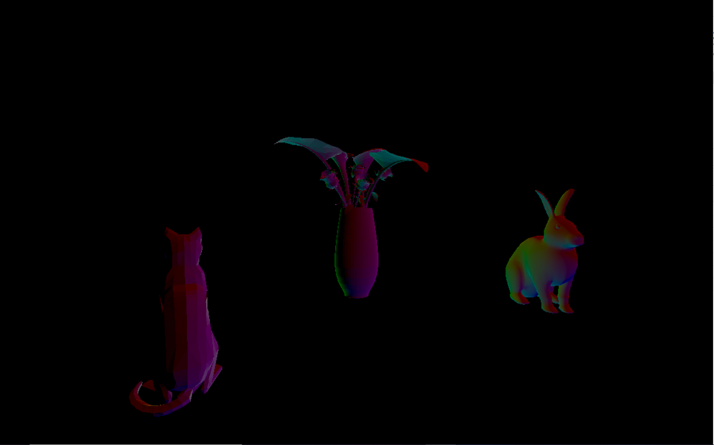
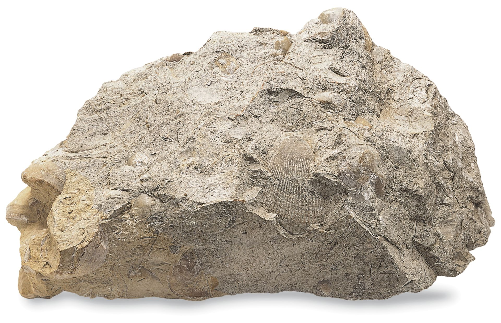
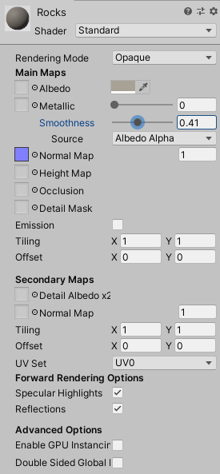

Lab2:

1. https://drive.google.com/file/d/1jm5tZwvc1yi4kVafbkX5BaZ12XC7s1iX/view?usp=sharing

2. 

Lab3:

1.https://drive.google.com/open?id=1qJvG1p790rMQZbRrcGMnlnbkHe5YLtrI

2. Description of materials:

  a. Cube on the bottom left: This is a phong material with a specular highlight of green, from the Three.js default shaders/materials
  
  b. Torus knot in the center: this is the lab's provided fragment shader that changes the rgb value of the color based on the two provided colors and the z position of the current fragment
  
  c. The top right torus knot: Another one of the Three.js provided shaders, this is a toon shader with a specular highlight in white
  
  d. The orbiting torus knot: My custom shader, which uses the elapsed time since the program started as a uniform variable to change the color as the sin/cos of time (specifically: R = sin(-time) G = cos(time) B = sin^2(time)).

Lab 4:
Answers:

  a. x = u*8
  
  b. y = (1-v)*8
  
  c. (3,6) white
  
https://drive.google.com/open?id=1nHOejJ1jHoB9YiX3IAfbWAYOwnO-OiLs

Part 1 Texture A (uses three.js built in texture functionality) - used THREE.js built in texturing to add a flat texture

Part 1 Texture A & Normal Map A (uses three.js built in texture functionality) - used THREE.js build in texturing as well as THREE.js built in handling of normal maps to add surface texture without affecting geometry

Part 1 Texture B & Normal Map B (new texture/normal map combo using built in three.js functionality) - used THREE.js build in texturing as well as THREE.js built i handling of normal maps to add surface texture without affecting geometry

Part 2 Texture C (load this texture with shaders, as we worked through in the lab together) - used a sample2D uniform to apply a 2D texture to a cube via shader

Part 2 Texture D (tile this texture at least by showing a 2x2 grid) - multiplied the vUv uniform by 2, subtracted one to make sure that all of the tiles were sampling from the same place

Lab 5:
1. https://drive.google.com/open?id=1wi5NwOnxVwsjDwcccpbzmqGTFxlJPZr2

2. Made the particle system be rainbow circles as exhaust, added my own toon shader to all of the materials. The particle system uses a sprite that I made, changes its color over lifetime between 6 keys in the rainbow colors, and has size and velocity modified via animation curve. System uses world simulation space so it follows the car cartoonishly, instead of always staying in the same spot relative to itself. My toon shader uses the light and viewer direction to find the half vector and light intensity, and then does a smoothstep to get distinctive color banding.

Lab 6:
1. Lights:
   - area light: light is emitted from one side of a rectangular plane. Lighting is baked, not realtime.
   - point light: light emitted in all directions from a point. Light decays as a function of 1/(distance)^2.
   - emissive material: light is emitted from every surface of an emissive object
   - directional light: light does not originate from any point, is cast along a vector across the whole scene.
   - spotlight: light is emitted in a cone from an origin point
2. Materials

Material has a brown/gray albedo, roughness normal map taken from the default floor, and some shine to get a soft specular highlight, because these rocks look kind of smooth.
3. Textures
   -added car from turbosquid with diffuse map for albedo, specular map for the metallic/smoothness, and a normal map for details
   -added cube with a rainbow cubemap texture and high smoothness
4. Skybox
   -HD 360 image of a sunset, contributing to lighting in the scene. Tinted directional light to match the sky.
5. Final result

